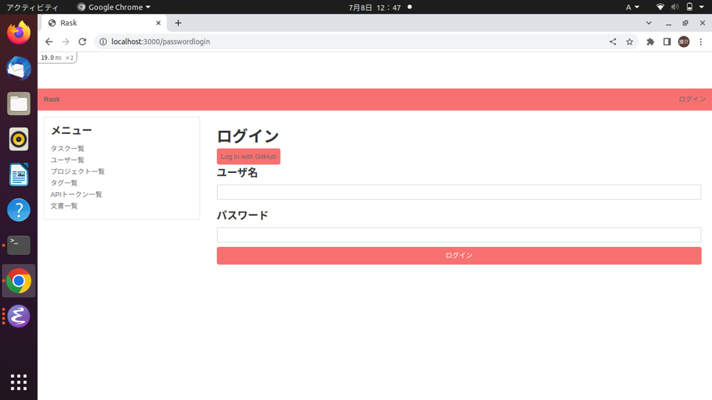

# How to contribute to Rask
## テストユーザの作成
テストユーザとは，開発時の使用が想定されるテスト用アカウントである．
テストユーザは，`rake`コマンドを用いて作成する．

### テストユーザの作成方法
- `rask/`以下で`rake 'create_user:user[<name>,<password>]'`と入力する．
- 上記のコマンドで以下のユーザが作成される．
  - ユーザ名: `<name>`
  - パスワード: `<password>`

### テストユーザのログイン方法
- Raskのトップページから「ログイン」をクリックする．
- 入力フォームにユーザ名とパスワードを入力する．
- 「ログイン」をクリックする．



## テスティングガイド
### テストの追加
新たにテストを追加する場合，`test/`以下のテストファイルにテストメソッドを追加する．
テストメソッドは，テスト名，ブロック(テストの処理)を引数に持つ．
```ruby
test "the truth" do
  assert true
end
```
上記のコードは，以下のコードと同等にふるまう．
```ruby
def test_the_truth
  assert true
end
```
テスト実行前に毎回実行する処理をsetupメソッドで記述できる．
```ruby
setup do
  @user = user(:one)
end
```

例として，UserControllerクラスのshowメソッドのテストを追加する手順を示す．
- `test/controllers/user_controller_test.rb`にテストメソッドを追加する．
- 追加するテストメソッドを以下に示す．
```ruby
1: test "should show user" do
2:   log_in_as(@user)
3:   get user_url(@user)
4:   assert_response :success
5: end
```
1行目: `should show user`はテストの名前である．
2行目: `log_in_as`はテストヘルパメソッドで，ログイン状態のユーザのモックオブジェクトを作っている．`log_in_as`メソッドは，`test/test_helper.rb`に定義されている．
3,4行目: モックユーザのユーザページにGetリクエストを送り，レスポンスコードが200番台であることをassertしている．

### テストの実行
テストは以下のコマンドで実行できる
```command
$ bundle exec rails test
```
